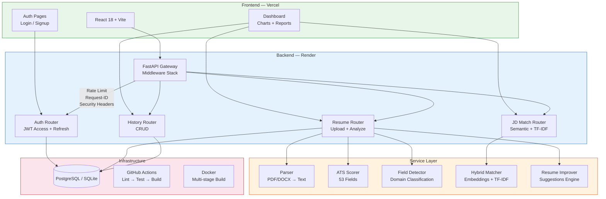

# 🤖 AI Resume Analyzer

[](https://github.com/arunsingh225/AI-Resume-Analyzer/actions)
[](https://python.org)
[](https://react.dev)
[](LICENSE)

**🌐 Live:** [ai-resume-analyzer-tawny-theta.vercel.app](https://ai-resume-analyzer-tawny-theta.vercel.app) &nbsp;|&nbsp; **📡 API:** [ai-resume-analyzer-api-1p6m.onrender.com](https://ai-resume-analyzer-api-1p6m.onrender.com/docs)

An AI-powered SaaS platform that analyzes resumes against ATS (Applicant Tracking System) standards, matches them to job descriptions using hybrid semantic AI, and provides actionable improvement suggestions.

---

## 🏛 Architecture



### Middleware Pipeline
```
Request → SecurityHeaders → RequestID → CORS → RateLimiter → Router → Response
             HSTS/CSP         UUID-8      Origins   slowapi
```

---

## ✨ Features

### 🎯 Core Analysis
- **ATS Scoring** — Weighted scoring across 5 dimensions (keywords, formatting, sections, experience, skills) calibrated for 53+ professional fields
- **Field Detection** — Automatically detects your career domain (Frontend, Data Science, Finance, etc.) from resume content
- **Section Analysis** — Identifies missing sections and provides field-specific recommendations

### 🤖 AI-Powered
- **Semantic JD Matching** — Uses `sentence-transformers` (all-MiniLM-L6-v2) for meaning-based similarity
- **Hybrid Matching** — 60% semantic embeddings + 40% TF-IDF with honest fallback to TF-IDF when model unavailable
- **Smart Skill Detection** — Synonym-aware matching (e.g., "ML" = "Machine Learning" = "Deep Learning")

### 📊 Data Visualization
- **Radar Charts** — 5-axis ATS breakdown (Recharts)
- **Skill Distribution** — Horizontal bar charts for skill categories
- **Animated Scores** — Smooth number transitions with ease-out cubic

### 🔒 Security
- **JWT Dual-Token Auth** — Short-lived access tokens (15 min) + refresh tokens (7 days)
- **Auto-Refresh** — Transparent token renewal with request queuing on frontend
- **Rate Limiting** — slowapi (3/min signup, 5/min login, 3/min OTP)
- **Password Validation** — 8+ chars, uppercase, lowercase, digit required
- **Magic Byte Validation** — Verifies actual file content, not just extensions
- **Security Headers** — HSTS, X-Frame-Options, X-Content-Type-Options, Referrer-Policy
- **Request-ID Tracing** — Every request gets a UUID for log correlation

### 🔍 Observability
- **Structured JSON Logging** — Machine-readable logs with timestamp, level, module, request-ID
- **Health Endpoints** — `/health`, `/ready` (DB check), `/live` for orchestrators
- **Request Timing** — Every request logged with method, path, status, and milliseconds

### 🎨 UI/UX
- **Dark Mode** — System preference detection + manual toggle + persistence
- **Glassmorphism Design** — Custom design system (Syne + DM Sans typography)
- **Skeleton Loaders** — Shimmer animations during loading states
- **Toast Notifications** — Context-based auto-dismiss notifications
- **Error Boundaries** — Crash protection with retry UI
- **Responsive** — Mobile-first, works on all screen sizes

### 📝 SaaS Features
- **Analysis History** — All analyses persisted with SHA-256 dedup
- **Feedback System** — Star rating, category selection, comments
- **PDF/DOCX Support** — Upload any resume format
- **Report Downloads** — Export analysis as JSON or PDF

---

## 🏗 Tech Stack

| Layer | Technology |
|-------|-----------|
| **Frontend** | React 18, Vite, Tailwind CSS, Recharts, Lucide Icons |
| **Backend** | FastAPI (lifespan), SQLAlchemy 2.x, Pydantic v2, slowapi |
| **AI/ML** | sentence-transformers (all-MiniLM-L6-v2), scikit-learn (TF-IDF) |
| **Database** | SQLite (dev) / PostgreSQL (prod) + Alembic migrations |
| **Auth** | JWT dual-token (python-jose), bcrypt, passlib |
| **Observability** | Structured JSON logging, request-ID tracing, health checks |
| **Security** | Rate limiting, HSTS, CSP, security headers middleware |
| **Testing** | pytest (87 tests), pytest-cov, coverage enforcement |
| **CI/CD** | GitHub Actions (ruff + mypy + bandit → tests → build) |
| **DevOps** | Docker multi-stage, docker-compose, Nginx, Render + Vercel |

---

## 🚀 Quick Start

### Prerequisites
- Python 3.11+
- Node.js 18+

### 1. Clone & Setup Backend
```bash
git clone https://github.com/arunsingh225/AI-Resume-Analyzer.git
cd AI-Resume-Analyzer/backend

# Create virtual environment
python -m venv venv
source venv/bin/activate  # Windows: venv\Scripts\activate

# Install dependencies
pip install -r requirements.txt

# Setup environment
cp .env.example .env
# Edit .env with your JWT_SECRET

# Run migrations
alembic upgrade head

# Start server
uvicorn app.main:app --reload
```

### 2. Setup Frontend
```bash
cd ../frontend
npm install
npm run dev
```

### 3. Open
Navigate to `http://localhost:5173`

### Docker (One-command)
```bash
docker-compose up --build -d
# Frontend: http://localhost
# Backend API: http://localhost:8000
# API Docs: http://localhost:8000/docs
# PostgreSQL: localhost:5432
```

---

## 🧪 Testing

```bash
cd backend
python -m pytest tests/ -v --cov=app --cov-report=term-missing

# 87 tests covering:
# - Auth (25 tests): signup, login, refresh tokens, password validation, /me
# - API Integration (24 tests): upload, validation, feedback, history
# - Parser (21 tests): text cleaning, email/phone extraction, formatting
# - ATS Scorer (7 tests): scoring, grades, field-specific logic
# - JD Matcher (16 tests): TF-IDF, tokenization, semantic matching
```

### CI Pipeline (runs on every push)
```
ruff lint → ruff format → bandit security → mypy types → pytest (70% coverage) → frontend build
```

---

## 📁 Project Structure

```
AI-Resume-Analyzer/
├── backend/
│   ├── alembic/                    # DB migration framework
│   │   ├── env.py                  # Migration environment config
│   │   └── versions/               # Migration scripts
│   ├── app/
│   │   ├── config.py               # Pydantic v2 Settings (ConfigDict)
│   │   ├── constants.py            # Shared constants (DRY)
│   │   ├── database.py             # SQLAlchemy 2.x DeclarativeBase
│   │   ├── main.py                 # FastAPI + lifespan + middleware
│   │   ├── middleware.py            # RequestID + SecurityHeaders
│   │   ├── routers/
│   │   │   ├── auth.py             # Auth + refresh tokens + rate limiting
│   │   │   ├── resume.py           # Upload + analysis + history save
│   │   │   ├── feedback.py         # Feedback CRUD + stats
│   │   │   ├── history.py          # Analysis history CRUD
│   │   │   └── ...
│   │   ├── services/
│   │   │   ├── ats_scorer.py       # ATS scoring engine (53 fields)
│   │   │   ├── field_detector.py   # Career field detection
│   │   │   ├── jd_matcher.py       # JD matching (semantic + TF-IDF)
│   │   │   ├── semantic_matcher.py # sentence-transformers wrapper
│   │   │   ├── parser.py           # Resume text extraction
│   │   │   └── ...
│   │   └── utils/
│   │       ├── auth_utils.py       # JWT access + refresh tokens
│   │       ├── logger.py           # Structured JSON logging
│   │       └── response.py         # Standardized API responses
│   ├── tests/                      # 87 pytest tests
│   ├── alembic.ini                 # Alembic configuration
│   └── requirements.txt
├── frontend/
│   ├── src/
│   │   ├── components/
│   │   │   ├── ui/                 # ErrorBoundary, Toast, Skeleton, Feedback
│   │   │   ├── charts/             # ATSRadarChart, SkillBarChart
│   │   │   └── ...                 # 15+ feature components
│   │   ├── pages/                  # Home, Login, Signup, Dashboard
│   │   ├── hooks/                  # useAuth (dual-token), useAnimatedNumber
│   │   └── services/               # API client (auto-refresh), auth helpers
│   └── tailwind.config.js          # Custom design system
├── .github/workflows/ci.yml        # CI: lint + security + test + build
├── Dockerfile                      # Multi-stage build
├── docker-compose.yml              # PostgreSQL + backend + frontend
├── nginx.conf                      # Production reverse proxy
└── render.yaml                     # Render deployment config
```

---

## 🔧 Environment Variables

| Variable | Default | Description |
|----------|---------|-------------|
| `JWT_SECRET` | (required) | Secret key for JWT signing |
| `DATABASE_URL` | `sqlite:///./resume_analyzer.db` | Database connection string |
| `CORS_ORIGINS` | `http://localhost:5173` | Comma-separated allowed origins |
| `ENABLE_SEMANTIC_MATCHING` | `true` | Toggle AI semantic matching |
| `LOG_LEVEL` | `INFO` | Logging level (DEBUG/INFO/WARNING) |
| `RATE_LIMIT_AUTH` | `5/minute` | Auth endpoint rate limit |

---

## 📄 API Documentation

Once running, visit: `http://localhost:8000/docs` (Swagger UI)

### Key Endpoints
| Method | Endpoint | Auth | Description |
|--------|----------|------|-------------|
| `POST` | `/auth/signup` | ❌ | Create account (rate: 3/min) |
| `POST` | `/auth/login` | ❌ | Login → access + refresh tokens |
| `POST` | `/auth/refresh` | ❌ | Exchange refresh token for new pair |
| `GET` | `/auth/me` | ✅ | Get current user profile |
| `POST` | `/api/resume/analyze` | ✅ | Upload + full analysis |
| `POST` | `/api/jd/match` | ✅ | Match resume to job description |
| `GET` | `/api/history/` | ✅ | List past analyses (paginated) |
| `POST` | `/api/feedback/` | ⚡ | Submit feedback (optional auth) |
| `GET` | `/health` | ❌ | Health check |
| `GET` | `/ready` | ❌ | Readiness (DB connectivity) |
| `GET` | `/live` | ❌ | Liveness probe |

---

## 📜 License

MIT License — See [LICENSE](LICENSE) for details.
